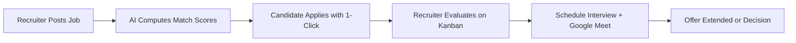

# 🚀 JobPilot AI

An agentic AI-powered recruitment platform connecting top talent with high-growth companies through deterministic 5-pillar matching, interactive Kanban applicant tracking, and automated interview scheduling.

<p align="center">
  
  
  
  
  
  
</p>

---

## 🌟 Key Features

- **🎯 Deterministic 5-Pillar Matching**: Calculates transparent 0–100% compatibility scores between candidate profiles and job requirements.
- **💡 Skill Gap Intelligence**: Identifies missing skills and predicts exact match score improvements (e.g., `+8% boost by adding Docker`).
- **🤖 Autonomous Agentic Workflow**: Proactive candidate alerts, automated applicant tier ranking, and interview room generation.
- **📋 Recruiter Kanban Pipeline**: Drag-and-drop or 1-tap applicant progression across 6 stages (`APPLIED` → `UNDER_REVIEW` → `SHORTLISTED` → `INTERVIEW` → `OFFER` → `REJECTED`).
- **📄 Multi-Version Resume Management**: Upload multiple resumes, set primary defaults, and manage privacy (`PRIVATE`, `APPLICATION_ONLY`, `RECRUITER_VISIBLE`).
- **📅 Automated Interview Scheduling**: Schedule screening, technical, and final interviews with integrated Google Meet links.
- **🛡️ Admin Governance & Audit Trail**: 1-click company verification badge, job listing moderation, user account controls, and tamper-evident audit logging.
- **⚡ Zero-Config Quickstart**: Works out of the box with an automatic in-memory fallback store — no local PostgreSQL setup required to test.

---

## 👥 Roles & Permissions

The platform supports 3 dedicated user roles with strict Role-Based Access Control (RBAC):

| Role | Target User | Core Capabilities |
|:---|:---|:---|
| **Candidate** (`JOB_SEEKER`) | Job Seekers & Professionals | • Build verified profile (skills, experience, projects, preferences)<br>• Upload & version resumes with privacy controls<br>• Discover jobs with 5-pillar compatibility & skill gap tips<br>• 1-click application submission & timeline tracking<br>• View interview invitations & Google Meet links<br>• Configure custom job alerts & bookmark saved jobs |
| **Recruiter** (`RECRUITER`) | Hiring Managers & Talent Teams | • Manage company profile & verified branding<br>• Create, edit, and close job postings with skill requirements<br>• Review applicants on an interactive 6-stage Kanban board<br>• View candidate resumes with strict IDOR protections<br>• Add private internal evaluation notes<br>• Schedule interviews with auto-advancement of candidates |
| **Administrator** (`ADMIN`) | Platform Operations & Trust | • Real-time platform analytics (users, jobs, conversion funnel)<br>• 1-click company verification (grant/revoke trust badges)<br>• Content moderation: inspect & take down non-compliant jobs<br>• User account management (suspend, activate, verify emails)<br>• Query immutable system audit logs (actor, IP, action, timestamp) |

---

## 🤖 How the Agentic AI Works & Its Workflow

JobPilot AI replaces static search filters with an autonomous **Agentic Perception-Reasoning-Action Loop** that works continuously on behalf of both candidates and recruiters:

```mermaid
flowchart TD
    subgraph P [1. Perception & Ingestion]
        J[New / Updated Job Postings] --> Ingest[Data Ingestion Agent]
        R[Candidate Resumes & Skills] --> Ingest
        M[Market-Wide Skill Demand] --> Ingest
    end

    subgraph RZ [2. Agentic Reasoning & Evaluation]
        Ingest --> Norm[Tech Synonym Normalizer\n(e.g., 'react.js' -> 'react')]
        Norm --> Engine[5-Pillar Compatibility Engine]
        Engine --> Gap[Skill Gap & Score Uplift Predictor]
        Engine --> Tier[Qualification Tier Classifier\n(Exceptional / Strong / Moderate / Low)]
    end

    subgraph A [3. Autonomous Actions & Tool Execution]
        Gap --> Alert[Candidate Co-Pilot: Trigger Match Alerts & Skill Recommendations]
        Tier --> Rank[Recruiter Co-Pilot: Auto-Rank Applicants on Kanban Board]
        Rank --> Scheduler[Interview Coordinator: Generate Google Meet & Auto-Advance Stage]
    end

    subgraph F [4. Feedback & Uplift Loop]
        Alert -->|Candidate Upskills & Updates Profile| Ingest
    end
```

### The 3 Autonomous Agent Roles

1. **Candidate Career Co-Pilot Agent**:
   - **Continuous Job Monitoring**: Evaluates every new job against the candidate's profile, parsed resumes, and workplace preferences.
   - **Market Skill Gap Advisory**: Analyzes open market requirements to highlight missing skills that offer the highest score uplift (e.g., *"Adding Docker can boost your match score by +8% across active roles"*).
   - **Proactive Alerts & Digests**: Triggers in-app alerts and email notifications only when a job meets the candidate's personalized match score threshold (e.g. $\ge 75\%$).

2. **Recruiter Talent Co-Pilot Agent**:
   - **Automated Screening & Tiering**: Instantly ranks incoming applicants into qualification tiers (`EXCEPTIONAL`, `STRONG`, `MODERATE`, `LOW`) using normalized technical skill overlap.
   - **Pipeline Automation**: Auto-advances candidates across the Kanban pipeline (e.g., moving an applicant directly to the `INTERVIEW` stage upon meeting scheduling).
   - **Interview Coordination**: Automatically provisions interview meeting rooms (Google Meet) and notifies both candidate and recruiter with calendar metadata.

3. **Autonomous Learning & Feedback Loop**:
   - When a candidate acts on the agent's recommendation and adds a skill to their profile, the agent immediately re-computes scores across all market openings, updating recommendations in real time.

---

## 🧠 Deterministic 5-Pillar Matching Engine

Job compatibility is calculated deterministically across 5 weighted pillars:

| Pillar | Weight | What It Evaluates |
|:---|:---:|:---|
| **1. Required & Nice-to-Have Skills** | **40%** | Normalized technical skill overlap (`react.js` $\leftrightarrow$ `react`, etc.) |
| **2. Experience Level** | **20%** | Candidate years of experience vs. job seniority requirements |
| **3. Semantic & Title Alignment** | **20%** | Profile headline & target roles aligned with job title |
| **4. Practical Projects & Portfolio** | **10%** | Hands-on project portfolio utilizing required technologies |
| **5. Candidate Career Preferences** | **10%** | Workplace preference (`REMOTE`, `HYBRID`, `ONSITE`) & salary match |

### Match Tiers
- 🟢 **Exceptional Match**: 85% – 100%
- 🔵 **Strong Match**: 70% – 84%
- 🟡 **Moderate Match**: 50% – 69%
- ⚪ **Low Match**: Below 50%

---

## 🔄 End-to-End Application Workflow



---

## 💻 Tech Stack

- **Frontend**: React 18, Vite, Tailwind CSS, TanStack React Query, Zustand, React Hook Form, Zod, Lucide React, Axios.
- **Backend**: Node.js, Express, Prisma ORM, PostgreSQL (with dual-mode in-memory fallback), JWT (Access + Refresh cookies), BcryptJS, Helmet, Rate Limiting.

---

## ⚡ Quickstart Guide

### Prerequisites
- [Node.js](https://nodejs.org/) `>= 18.x`
- `npm`

### 1. Start the Backend
```bash
cd backend
npm install
npm run dev
```
> 💡 *The backend automatically runs on `http://localhost:5000` with the built-in demo database. No database setup needed for instant testing!*

### 2. Start the Frontend (in a separate terminal)
```bash
cd frontend
npm install
npm run dev
```
> 💡 *Open [http://localhost:5173](http://localhost:5173) in your browser.*

---

## 🔑 Demo Test Accounts

You can test all 3 roles immediately. On the Login screen, click the **1-Tap Demo Login** buttons:

| Role | Email | Password | What You Can Test |
|:---|:---|:---|:---|
| **Candidate** | `alex.seeker@example.com` | `Password123` | View 94% match scores, skill gap advice, submitted applications & interview invites |
| **Recruiter** | `sarah.recruiter@techcorp.com` | `Password123` | Post jobs, drag-and-drop applicants on Kanban board, schedule interviews |
| **Admin** | `admin@jobpilot.ai` | `Password123` | Platform analytics, 1-click company verification badge, job moderation & audit logs |

---

## 📁 Project Directory Structure

```
JobPilot AI/
├── backend/
│   ├── prisma/
│   │   └── schema.prisma        # Database models & enums
│   ├── src/
│   │   ├── config/              # Database & env config
│   │   ├── middleware/          # Auth (RBAC), security, validation & error handling
│   │   ├── modules/             # Auth, jobs, applications, resumes, interviews, admin, alerts
│   │   ├── services/            # 5-Pillar Matching Engine, email, storage
│   │   └── server.js            # Express application bootstrap
│   └── package.json
├── frontend/
│   ├── src/
│   │   ├── api/                 # Axios HTTP client & endpoint callers
│   │   ├── components/          # Kanban board, modals, navbar, match cards, UI kit
│   │   ├── pages/               # Candidate, Recruiter, Admin & Auth views
│   │   ├── routes/              # Protected & role-guarded route definitions
│   │   ├── store/               # Zustand global state (auth & notifications)
│   │   └── App.jsx
│   ├── tailwind.config.js
│   ├── vite.config.js
│   └── package.json
└── README.md
```

---

## 🚀 Uploading to Git / GitHub

To push this project to your GitHub repository:

```bash
# 1. Initialize git
git init

# 2. Stage all files (.gitignore protects secrets and node_modules)
git add .

# 3. Create initial commit
git commit -m "feat: complete JobPilot AI platform with agentic workflows and 5-pillar matching"

# 4. Set main branch
git branch -M main

# 5. Link your GitHub repository
git remote add origin https://github.com/<your-username>/<your-repo-name>.git

# 6. Push to GitHub
git push -u origin main
```

---

<p align="center">
  <strong>JobPilot AI</strong> — Intelligent, transparent, and human-centric talent acquisition.
</p>
